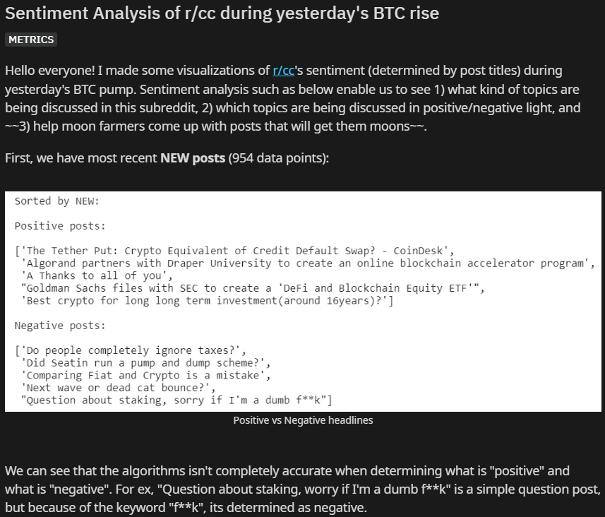
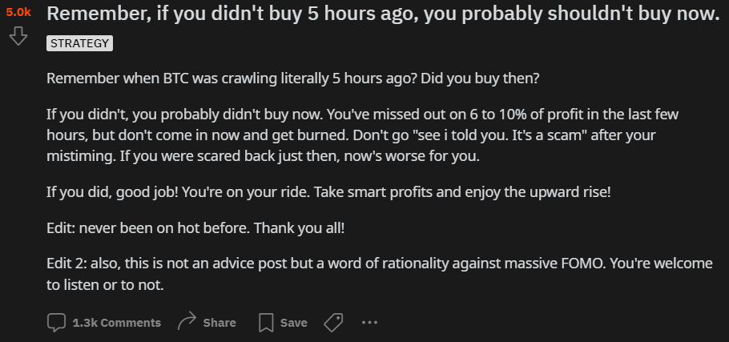
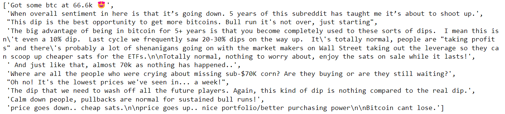
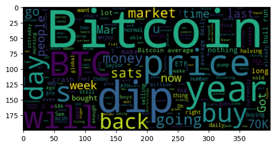
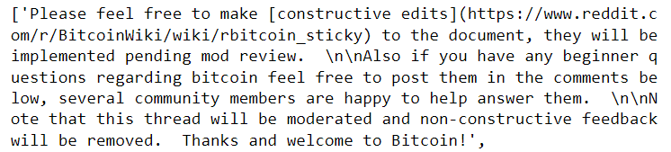
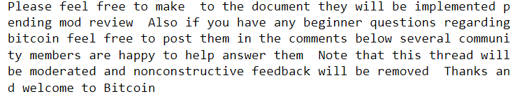
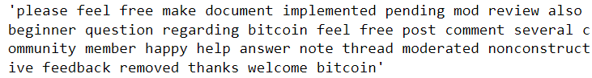
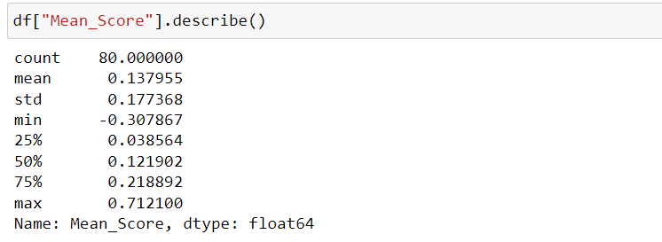

# Data Science Blog: Bitcoin Sentiment Analysis

March 15, 2024

#### Inspiration:
Three years ago, I was quite active in Reddit's Crypto Currency subreddit, [r/CryptoCurrency](https://www.reddit.com/r/CryptoCurrency/). Three years later, I read multiple news citing that Bitcoin has reached its all-time highs, and discussions that surrounded the subreddit three years ago are starting anew. I had run a sentiment analysis of the subreddit during the 2021 price pump (screenshot below) and I thought it would be interesting to return to the anlysis once more, now that I am better equipped with technology. You can view the original post [here](https://www.reddit.com/r/CryptoCurrency/comments/osc9c8/sentiment_analysis_of_rcc_during_yesterdays_btc/) 

#### Overview:
This mini-project will involve using [Reddit API](https://www.reddit.com/wiki/api/), [Python Reddit API Wrapper, PRAW](https://praw.readthedocs.io/en/stable/), [NLTK Package](https://www.nltk.org/), and other basic data science Python packages.

Data was extracted from Reddit via PRAW, cleaned using RegEx matching, preprocessed via tokenization and lemmatization, and analyzed via NLTK's Sentiment Analyzer.

## The process:

#### 1. Gathering data
The previous analyses only focused on post titles. However, this poses a problem for us because 1) post titles are short, and supposed to be eye-catching, sometimes leading to sarcastic or misleading analysis. 2) In reddit, what's more interesting is the conversations, rather than the post itself. For example, a not-so-special looking post such as this one garnered over 1.5 thousand comments, simply due to the discussions it promoted ([link](https://www.reddit.com/r/CryptoCurrency/comments/oroqj3/remember_if_you_didnt_buy_5_hours_ago_you/)):

So, I have made the decision to run a sentiment analysis on the top 100 posts from the Crypto Currency Subreddit.

The first step was to gain access to Reddit's API. Because I had created my key and password three years ago, the process was not too difficult, but newcomers must [register and create](https://www.reddit.com/wiki/api/) their keys on Reddit's API site. Then, we can use PRAW (Python Reddit API Wrapper) to create a Reddit instance:

```python 
reddit = praw.Reddit(
    client_id="xxx",
    client_secret="xxx",
    user_agent="crawler",
    username="Chikkin1013",
    password="xxx"
)
```

Obviously, one must replace the "xxx" with one's id, secret and password. One thing that tripped me up in the process was not turning off my two-factor authentication, so if you are getting an *OAuthException: invalid_grant error processing request* error, turn your 2FA off!

The next step was to gather post details from r/CrytoCurrency. PRAW is well implemented in that it enables us to pull data from hot, new, and top as simple as this:

```python 
comments_dict = {'Post': [], 'Comments': []}

for submission in reddit.subreddit("bitcoin").hot(limit=100):
    submission_title = submission.title
    comments = []

    for comment in submission.comments:
        if isinstance(comment, MoreComments):
            continue
        else:
            comments.append(comment.body)
    comments_dict['Post'].append(submission_title)
    comments_dict['Comments'].append(comments)
df = pd.DataFrame(comments_dict)
```

Replacing .hot with .top or .new changes the database from where the data is requested from. Let us see the top post's comments (Note: this analysis was done on 4:20 PM March 15, 2024, right after a 10% drop):



We see that there are a mix of emotion in the comments to this post alone. Let us visualize the conversation using a Word Cloud:


Now we see one major problem. There are too many "speech words", or called stopwords in data science language, in the comments that it is extremely difficult to see which ones contribute to the sentiment. For example, what sentiment does "year" have? how about "price"? A certain level of clean-up is required before we can run a word-by-word sentiment analysis (lexicon-based analysis) on the comments.

#### 2. Data processing
The first step of data processing was using regular expressions to remove any non-desirable characters from the list of comments. For example, emojis, escape characters (ex: \n, \r, etc), hyperlinks, deleted or removed comments (ex: [deleted] or [removed]) may interfere with our analysis. These were removed using Python's [own regex operations](https://docs.python.org/3/library/re.html).

After the clean up, a comment such as this one:

was cleaned up to a comment like this:


Yet we are not done yet. In text analysis, there are three important processes called tokenizing, stemming, and lemmatizing. Tokenizing refers to splitting sentences into groups of words. So the sentence "feel free to make to the documents" will be convereted into ["feel", "free", "to", "make", "to", "the", "documents"]. Stemming refers to removes the last letters of a given word to reduce it to the base form. For example, "documents" will be reduced to "document". However, over-stemming of words might occur. For example, the word "documentation" might be reduced to "documen" as "-tation" are frequent end-of-words. Lemmatization, albeit more expensive than stemming, ensures that the reduced words (lemmas) are always useful words. Thus, "documents", "documentation", "documenting" will all be reduced to the useful lemma "document". 

Furthermore, in this process, we remove stop words. Stop words, as previously mentioned, are words that are frequently used in a language that do not contribute to the general meaning of a sentence. In English, words such as "are", "we", "and" are a few examples. Tokenizing, lemmatizing, and filtering can be easily implemented using the NLTK library:

```python 
def preProcess(original):
    # tokenizing and filtering out non-stop words:
    tokens = word_tokenize(original.lower())

    # removing stopwords:
    filtered = [token for token in tokens if token not in stopwords.words('english')]
    
    # lemmatizing tokens:
    lemmatizer = WordNetLemmatizer()
    lemmatized = [lemmatizer.lemmatize(token) for token in filtered]
    out = ' '.join(lemmatized)
    return out

preProcess(df["Comments"].iloc[0][1])
```
Here is the fully cleaned sentence from above:


Now we are in the position to determine the overall sentiment of r/CryptoCurrency using NLTK's sentiment analyzer. NLTK's [SentimentIntensityAnalyzer](https://www.nltk.org/api/nltk.sentiment.vader.html) can return the polarity score of a sentence, which, according to the documentation, "Return a float for sentiment strength based on the input text. Positive values are positive valence, negative value are negative valence." Analyzing the sentiment on each comment and returning the total average sentiment:


We can conclude that the mean sentiment on March 15, 2024 for r/CryptoCurrency was slightly above the mean (Polarity varies between [-1, 1]).

Here is the wordcloud for all comments:


A one-off analysis of sentiments is not enough to tell us anything. However, if we are able to extract a time-annotated data of comments about when they were posted, it would be interesting to see the relationship between bitcoin price movements and bitcoin sentiment fluctuations.

The Jupyter Notebook version of this blog post can be found [here](https://github.com/youngil-1013/Reddit-Sentiment-Analysis).